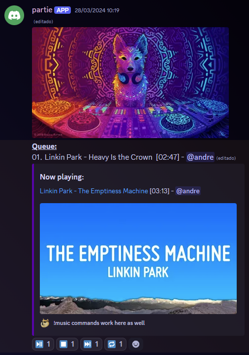

# Partie
Partie is a Discord bot that is aimed at helping you entertain your server members. It is a multi-purpose bot that can 
do a lot of things, such as playing music, moderating your server in a fun way, and much more. It is a bot that is 
constantly being updated and improved, so you can expect new features to be added regularly.

## Features
- **Music**: Play music from YouTube or Spotify.
- **Block Streams or Camera**: Block a user from streaming or using their camera individually. 
- **Roll**: Roll a dice.
- **Playlist Channel**: Create a playlist channel where users can add songs to the queue and easily interact with the bot.

